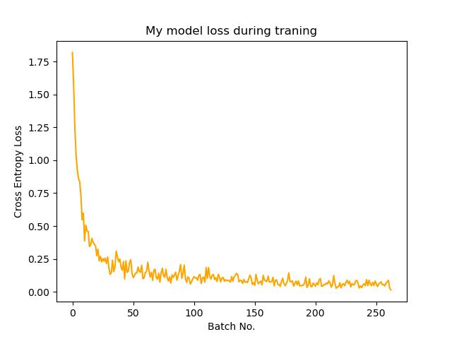
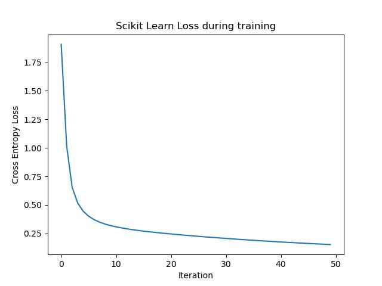
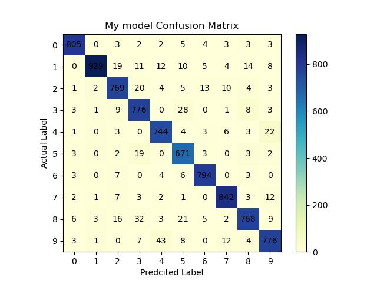
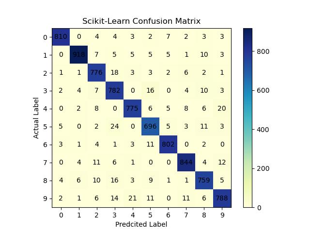

# Neural Networks from Scratch


A from-scratch implementation of an Artificial Neural Network (ANN) classifier whose core is written with **NumPy only** — no TensorFlow, PyTorch, or scikit-learn in the network itself. The network is built piece by piece from the chain rule and plain matrix multiplication, so the mathematics stays visible instead of hidden behind a framework, and it is then benchmarked against scikit-learn's `MLPClassifier` on **MNIST** (42,000 labeled digit images).

The experiment is a 784 → 50 → 20 → 10 fully connected network: two ReLU hidden layers and a softmax output layer.

## Table of Contents

- [Overview](#overview)
- [Quickstart](#quickstart)
- [Model Comparison](#model-comparison)
- [Figures](#figures)
- [Project Progress](#project-progress)
- [Entry Points](#entry-points)
- [Project Structure](#project-structure)
- [Implementation Notes](#implementation-notes)
- [API](#api)
- [Resources](#resources)

## Overview

The network is a fully connected feedforward classifier, designed around two pieces:

- **`Layer`** — a single layer: its own weight matrix, bias vector, and activation function.
- **`MyNeuralNetworkClassifier`** — assembles an ordered list of layers, propagates inputs forward, scores the result against the targets with cross-entropy loss, and runs the training loop.

A training step is a forward pass, a cross-entropy loss, and a backward pass that walks the layers in reverse applying one SGD update per layer. The full pipeline — CSV loading, `/255` scaling, an 80/20 split, batching, training, evaluation, and the scikit-learn comparison — lives in `main.ipynb`.

## Quickstart

Requires Python 3.12. NumPy is the only dependency of the network; the MNIST experiment additionally uses pandas, scikit-learn and matplotlib:

```bash
pip install numpy pandas scikit-learn matplotlib
```

### Data

`data/mnist-train.csv` holds 42,000 samples with 785 columns: a `label` column plus `pixel0`…`pixel783` with values in `[0, 255]`. The pipeline is:

1. Drop `label` to get `X`, keep it as `y`.
2. Scale the features to `[0, 1]` with `X = X / 255`.
3. Split 80/20 with `train_test_split(X, y, test_size=0.2, stratify=y)` → 33,600 training samples, 8,400 test samples.
4. Cut the training split into batches of 128 samples → 263 batches (262 full batches of 128 plus a last one of 64).

### Running the experiment

The notebook is the source of truth for every result in this README:

```bash
jupyter notebook main.ipynb
```

`main.ipynb` walks through the experiment step by step: load the data, split it, build the batches, train, evaluate with accuracy and a confusion matrix, repeat the whole thing with `MLPClassifier`, and save four figures to `images/`. A full run takes roughly four minutes, most of it spent inside scikit-learn's training loop.

Usage, mirroring the notebook:

```python
from classes.MyNeuralNetwork import MyNeuralNetworkClassifier
import numpy as np
import pandas as pd
from sklearn.model_selection import train_test_split

mnist = pd.read_csv("data/mnist-train.csv")
X = mnist.drop(columns="label").copy()
y = mnist["label"].copy()
X = X / 255

X_train, X_test, y_train, y_test = train_test_split(
    X, y, test_size=0.2, stratify=y
)

def create_batches(X, y, size=128):
    if X.shape[0] != y.shape[0]:
        raise ValueError("Number of samples in X and y do not match")
    return [(X[i:i+size], y[i:i+size]) for i in range(0, X.shape[0], size)]

nn = MyNeuralNetworkClassifier([50, 20], X.shape[-1], classes=10)

for batch_x, batch_y in create_batches(X_train, y_train):
    loss = nn.fit(batch_x, batch_y, return_loss=True)

print(nn.predict(X_test.iloc[[0]]))
```

`MyNeuralNetworkClassifier(layers_size, input_size, classes, class_names=[], max_iter=50, lr=0.01, batch_size=128)` builds a network with one ReLU hidden layer per size in `layers_size` and appends a softmax output layer of `classes` units. `fit` and `predict` expect `X` in the usual `(samples, features)` orientation and transpose it to `(features, samples)` internally, since that is how the forward pass multiplies `W @ X`. `fit` performs `max_iter` full-batch updates on whatever matrix it receives, so the caller owns the batching and the number of passes over each batch; pass `return_loss=True` to get the cross-entropy loss of the last update back instead of `None`.

## Implementation Notes

The design leans toward a **modular approach**: rather than separate `HiddenLayer` and `OutputLayer` classes, a single `Layer` class represents any layer. What changes between layers — the activation function — is just a constructor argument, which keeps the code smaller and makes each layer's behavior identical up to its own parameters.

Notable details:

- **Activations as a registry** — `Layer.activation_functions` maps names to functions, so a layer is configured by passing a string (`"relu"` or `"softmax"`) rather than a callable. Hidden layers default to ReLU; only the output layer uses softmax.
- **He initialization** — weights are drawn from `np.random.randn(size, prev_size) / np.sqrt(prev_size / 2)`, i.e. standard deviation `sqrt(2 / prev_size)`, which keeps activations from collapsing or exploding through ReLU layers. Biases start at zero.
- **Numerically stable softmax** — the maximum is subtracted before exponentiating (`exp(x - max) / sum(exp(x - max))`), so large logits cannot overflow. Outputs are proper probabilities that sum to 1 across the class axis.
- **Fused softmax + cross-entropy gradient** — the output layer uses `(y_hat - onehot(y)) / batch_size` directly instead of multiplying by the softmax Jacobian, which is mathematically identical for this loss pair and avoids building the `(classes, classes)` matrix per sample.
- **Mean gradients** — every gradient is divided by the batch size, and the loss is a mean over samples, so `lr` is independent of batch size. scikit-learn's `_compute_loss_grad` divides by `n_samples` the same way.
- **Gradients are computed and applied in one call** — `Layer.calc_gradient` stores `self.gradient` and immediately updates `weight` and `bias`, so `backward` is really "one SGD step over all layers".
- **Biases are column vectors** — `bias` has shape `(size, 1)` while `weight` has shape `(size, prev_size)`, matching the `(features, samples)` orientation used after transposing the input. Note that scikit-learn stores the transpose of this layout, `(features, units)`.
- **Backpropagation through weights** — the hidden-layer gradient is `(in_gradient.T @ self.nxt_layer_weight).T * (self.z > 0)`: the incoming gradient is pulled back through the next layer's weight matrix, then masked where the pre-activation was not positive.
- **`fit` is the step budget** — it runs `max_iter` forward/backward cycles over the matrix it is given. In the MNIST experiment that is 50 updates on each of 263 batches, so 13,150 parameter updates in total.
- **Type hints on the activations** — `relu` and `softmax` are annotated `np.ndarray -> np.ndarray`.
- **Naming convention** — `X` always refers to the input of a layer and `out` to the output of its activation function, so `calc_output(X)` and `backward(X, out)` stay symmetrical.

## Model Comparison

Both models were trained on the same split, with the same architecture, the same batch size, and the same number of parameter updates. scikit-learn's `MLPClassifier` is configured with `max_iter=50` to match the `max_iter=50` used by `fit`.

| Criterion | `MyNeuralNetworkClassifier` | `sklearn.neural_network.MLPClassifier` |
| --- | --- | --- |
| Configuration | `MyNeuralNetworkClassifier([50, 20], 784, classes=10)` | `MLPClassifier([50, 20], batch_size=128, solver="sgd", max_iter=50)` |
| Architecture | 784 → 50 → 20 → 10 | 784 → 50 → 20 → 10 |
| Hidden activation | ReLU | ReLU |
| Output activation | softmax | softmax (multiclass) |
| Loss | cross-entropy, mean over the batch | log loss |
| Trainable parameters | 40,480 | 40,480 |
| Weight init | He normal — `randn(n, prev) / sqrt(prev / 2)` | Glorot uniform — `U(-sqrt(6 / (fan_in + fan_out)), +)` |
| Bias init | zeros | Glorot uniform (non-zero) |
| Optimizer | SGD, implemented in `Layer.calc_gradient` | SGD, internal to scikit-learn |
| Learning rate | fixed `lr=0.01` | fixed `0.001` (`learning_rate="constant"`) |
| L2 regularization | none | `alpha=1e-4` added to the gradient |
| Gradient scaling | divided by batch size | divided by batch size |
| Batch size | 128 | 128 |
| Batch order | sequential slices, no shuffling | shuffled every epoch |
| Weight matrix shape | `(units, features)` | `(features, units)` |
| Iterations | `max_iter=50` per batch | `max_iter=50` epochs |
| Parameter updates | 13,150 | 13,150 |
| **Test accuracy** | **93.74 %** | **94.64 %** |
| **Training time** | **96.50 s** | **119.18 s** |
| Convergence | fixed step budget, no early stop | `ConvergenceWarning` at `max_iter` |
| Dependencies | NumPy only | scikit-learn |

### Reading the results

The two implementations land within **0.90 percentage points** of each other on the held-out split, with the hand-written NumPy version **1.24× faster** (23.5 % less wall-clock time for the same number of gradient steps). Neither model hit an accuracy ceiling that would explain a wider gap, so the remaining difference comes from the configuration rows above rather than from one implementation being structurally worse.

Four things differ and are worth naming explicitly:

- **Initialization** — this network uses He normal initialization with zero biases, while `MLPClassifier` uses Glorot uniform for both weights and biases. He scaling is the standard choice for ReLU stacks; the non-zero bias init on the reference model is not.
- **Regularization** — `MLPClassifier` adds `alpha * coef` to every weight gradient, so the sklearn runs are implicitly L2-regularized. This implementation has no regularization at all, which is the most likely single cause of the small accuracy gap on the more confusable digits.
- **Batch order** — the batches here are sequential slices of the training split and are never shuffled, so each 128-sample batch is visited 50 times in a row. scikit-learn reshuffles the sample indices at the start of every epoch, which improves gradient quality at no extra cost.
- **Learning rate** — a fixed `lr=0.01` here versus a fixed `0.001` on the sklearn side. Note that scikit-learn's `solver="sgd"` defaults to `learning_rate="constant"`, so its learning rate is *not* annealed; `alpha` and `power_t` only take effect under `inv_scaling`.

Two caveats about the numbers themselves:

- **The loss curves are not directly comparable.** This implementation records one cross-entropy loss per batch, so the x-axis is the batch index and each point reflects a single 128-sample batch. scikit-learn's `loss_curve_` averages the loss over the whole training set once per epoch, so its x-axis is the epoch. Different x-axes, different averaging, and 263 points versus 50.
- **The runs are not reproducible.** `Layer.__init__` draws weights from `np.random.randn` with no seed, and the notebook's `train_test_split` call passes no `random_state`. Re-running the notebook produces different numbers each time, including the accuracies quoted above.

Both models emit a `ConvergenceWarning`-equivalent condition rather than converging: this network stops after its fixed step budget, and scikit-learn stops after `max_iter=50`. Neither was trained to a convergence criterion, so both accuracies are lower bounds on what these architectures can reach.

## Figures

All four are generated by `main.ipynb`.

| `MyNeuralNetworkClassifier` | `MLPClassifier` |
| --- | --- |
|  |  |
|  |  |

## Project Progress

### Completed

- [x] `Layer` class with He-initialized weight matrix and zero bias vector
- [x] Activation functions: ReLU (hidden default) and numerically stable softmax (output layer only)
- [x] Forward propagation (`Layer.calc_output`, `MyNeuralNetworkClassifier.forward`)
- [x] Cross-entropy loss over the softmax output (`MyNeuralNetworkClassifier.calc_loss`)
- [x] Network assembly: hidden layers from `layers_size`, softmax output layer of `classes` units, sizes wired from `input_size`
- [x] Backpropagation (`MyNeuralNetworkClassifier.backward`, `Layer.calc_gradient`)
- [x] Gradients: fused softmax + cross-entropy on the output layer, masked ReLU gradient on the hidden layers, bias gradients
- [x] SGD parameter update (`Layer.update_param_softmax` / `Layer.update_param_relu`)
- [x] Inference (`MyNeuralNetworkClassifier.predict`)
- [x] MNIST pipeline: CSV loading, `/255` scaling, stratified 80/20 split, batches of 128, per-batch loss tracking
- [x] Evaluation: test accuracy and confusion matrix over the held-out split
- [x] Side-by-side benchmark against `MLPClassifier` at matched architecture, batch size and parameter updates
- [x] Training-time measurement and four figures saved to `images/`

### Known Limitations

- **No seeding anywhere** — weights come from unseeded `np.random.randn` and the split uses no `random_state`, so every run differs.
- **`calc_loss` has no clipping** — it evaluates `np.log(y_hat[...])` directly on the softmax output. The *gradient* is numerically stable thanks to the fused form, but the *reported loss* becomes `inf` if a true-class probability underflows to zero.
- **No shuffling** — `create_batches` returns sequential slices, so each batch is revisited 50 times consecutively during training.
- **No regularization** — no L2 penalty and no dropout, unlike `MLPClassifier`'s default `alpha=1e-4`.
- **`class_names` is stored but never used** — it is assigned in `MyNeuralNetworkClassifier.__init__` and never read again.
- **`act_function` fails silently** — an unrecognized activation name makes the loop fall through and return `None` instead of raising.
- **`fit` couples epochs to batches** — `max_iter` counts updates on a single matrix, so the caller must call `fit` per batch to get multiple passes over the data.
- **`update_param_softmax` and `update_param_relu` are identical** — the softmax/ReLU split duplicates the same three lines.
- **Weight decay of the repository** — `classes/__pycache__/*.pyc` files are tracked in git and should be ignored, and `data/train.csv:Zone.Identifier` is a leftover Windows artifact.

### Ideas for Further Work

- [ ] Seed the weight initialization and the train/test split for reproducible results
- [ ] Mini-batch training and epoch looping as features of the class instead of a caller-side helper
- [ ] L2 regularization and dropout
- [ ] Multiple weight initialization strategies as a constructor option
- [ ] Model persistence (save/load trained weights)

## Entry Points

`test.py` is the original minimal script. It predates the evaluation code and the comparison, and its hyperparameters differ from the notebook, so the published results come from `main.ipynb` only.

| | `test.py` | `main.ipynb` |
| --- | --- | --- |
| Architecture | `[100]` — one hidden layer | `[50, 20]` — two hidden layers |
| Split | `random_state=123`, no `stratify` | `stratify=y`, no `random_state` |
| Accuracy | not computed | accuracy + confusion matrix |
| Training time | not measured | measured for both models |
| scikit-learn comparison | none | `MLPClassifier` |
| Figures | none | four saved to `images/` |

```bash
python3 test.py
```

## Project Structure

```
my-neural-network/
├── classes/
│   ├── Layer.py            # Single layer: parameters, activations, forward/backward steps
│   └── MyNeuralNetwork.py  # Network assembly, forward/backward passes, loss, training loop
├── data/
│   └── mnist-train.csv     # MNIST digits: 42,000 rows x (label + 784 pixels)
├── images/                 # Figures generated by main.ipynb
│   ├── my-training-loss.jpg
│   ├── my-nn-test-heatmap.jpg
│   ├── sklearn-traning-loss.jpg
│   └── sklearn-nn-test-heatmap.jpg
├── main.ipynb              # MNIST experiment + scikit-learn comparison
├── test.py                 # Minimal training script
└── README.md
```

## API

| Class | Method | Purpose |
| --- | --- | --- |
| `Layer` | `__init__(layer_size_, prev_size_, lr, activation="relu")` | Builds the weight matrix `(size, prev_size)` and bias column vector `(size, 1)`, and selects the activation |
| `Layer` | `relu(x)` / `softmax(x)` | Type-hinted activation helpers (`np.ndarray -> np.ndarray`) |
| `Layer` | `act_function(x)` | Applies the configured activation by name |
| `Layer` | `calc_output(X)` | Computes `(W @ X) + b`, caches it as `self.z`, and applies the activation |
| `Layer` | `softmax_gradient(y_hat, y)` | Fused softmax + cross-entropy gradient `(y_hat - onehot(y)) / batch_size` |
| `Layer` | `relu_gradient(in_gradient)` | Backpropagates through the next layer's weights and masks by `z > 0` |
| `Layer` | `update_param_softmax()` / `update_param_relu()` | Applies one SGD step to `weight` and `bias` (identical bodies) |
| `Layer` | `calc_gradient(in_gradient, y_hat=None, y=None)` | Computes the gradient for this layer and applies the update |
| `MyNeuralNetworkClassifier` | `__init__(layers_size, input_size, classes, class_names=[], max_iter=50, lr=0.01, batch_size=128)` | Builds the ReLU hidden layers plus the softmax output layer, and stores the hyperparameters |
| `MyNeuralNetworkClassifier` | `forward(X)` | Propagates `X` through every layer, caching each layer's input |
| `MyNeuralNetworkClassifier` | `backward(y, y_hat)` | Walks the layers in reverse, seeding the output layer with the loss gradient |
| `MyNeuralNetworkClassifier` | `calc_loss(y_hat, y)` | Mean cross-entropy loss of the network output |
| `MyNeuralNetworkClassifier` | `fit(X, y, return_loss=False)` | Transposes `X` and runs `max_iter` forward/backward steps, optionally returning the final loss |
| `MyNeuralNetworkClassifier` | `predict(X)` | Transposes `X` and returns `argmax(axis=0)` of the network output |

## Lessons Learned

At first I was stucked, since there were several approaches to implement a Neural Network, at first I made 2 classes `HiddenLayer` and `OutputLayer`, which I decided to simplify to a single class and set the activation function inside the class. Later I found other approach (PyTorch) which was creating Linear layers and Activation layers separately which results in a simpler calculation of gradients and cleaner code, overall.

Without a doubt the hardest part of this project was the gradient calculation, since at first I did a non-simplified calculation of the softmax gradient, which led me to NaN values in the prediction probabilities of the classes. Also the shape matching for matrix multiplication was tricky, since several matrices should be transposed when calculating the gradient.

Finally I noticed that initializing random weights and multiply them by 0.001 was no good for the model since this resulted in a vanishing gradient which led to barely any optimization and variability in the weights. So I changed to Kaiming He initialization which research suggest it works great for ReLU as the activation function.

## Resources

- [Stanford CS229: Machine Learning (Autumn 2018) — Lecture 10](https://www.youtube.com/watch?v=MfIjxPh6Pys&list=PLoROMvodv4rMiGQp3WXShtMGgzqpfVfbU&index=11)
- [Building a neural network FROM SCRATCH (no Tensorflow/Pytorch, just numpy & math) — Samson Zhang](https://www.youtube.com/watch?v=w8yWXqWQYmU)
- [Activation Function Explanation Video](https://youtu.be/hFa6sYJnTfs?si=UJHsJudcDerojEXf) - Spanish
- [Explanation of derivative of Softmax](https://davidbieber.com/snippets/2020-12-12-derivative-of-softmax-and-the-softmax-cross-entropy-loss/)
    - More detailed explanation: [link](https://eli.thegreenplace.net/2016/the-softmax-function-and-its-derivative/)
- [scikit-learn — `MLPClassifier`](https://scikit-learn.org/stable/modules/generated/sklearn.neural_network.MLPClassifier.html)